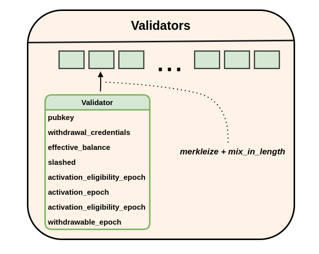
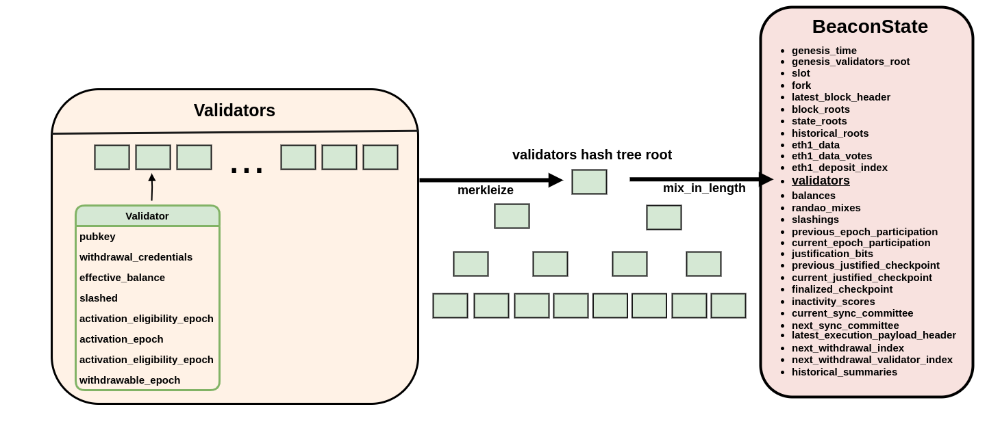
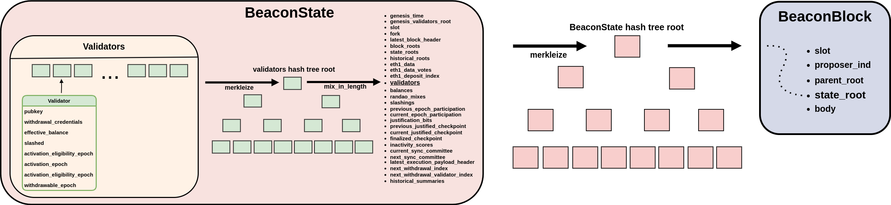

# slashing-proofoor
### Proof of slashed validators inside the EVM using EIP-4788

### **How it works (in pictures):**
##### (1) Proof validator is in chain's validator set:

  

##### (2) Proof validators is in chain's state:

  

##### (3) Proof state is in canonical chain:

  

